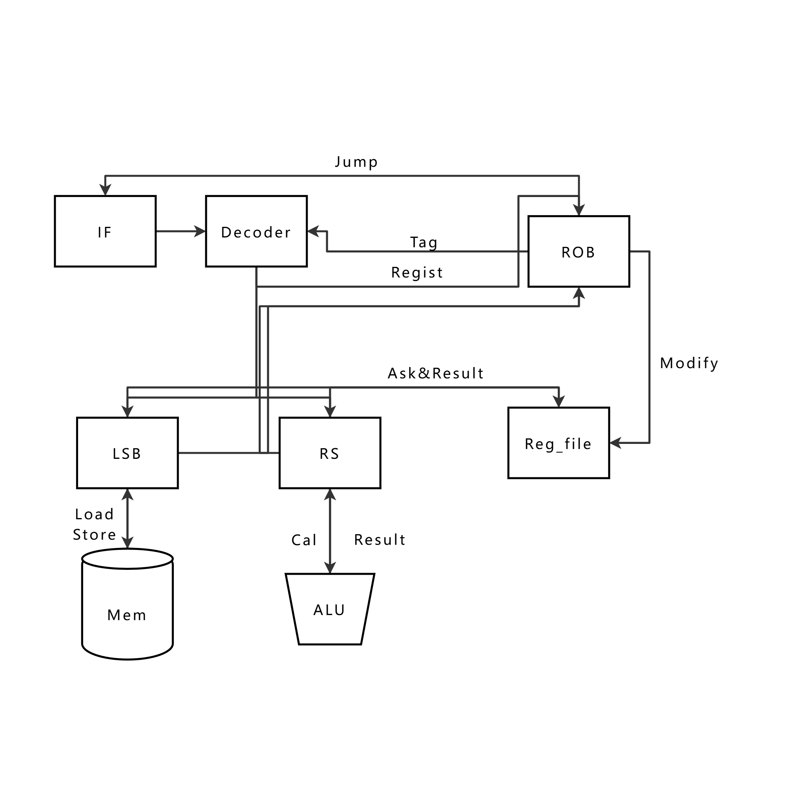

# RISCV-CPU 2024

## CPU 草图



## 项目说明

在本项目中，你需要使用 Verilog 语言完成一个简单的 RISC-V CPU 电路设计。

Verilog 代码会以软件仿真和 FPGA 板两种方式运行。你设计的电路将运行若干测试程序并可能有输入数据，执行得到的输出数据将与期望结果比较，从而判定你的 Verilog 代码的正确性。

你需要实现 CPU 的运算器与控制器，而内存等部件题面已提供代码。

### 项目阶段

- 完成 CPU 所需要的所有模块
- 通过 Simulation 测试
- 在 FPGA 上通过所有测试

### 时间安排

> 时间以上海交通大学 2024-2025 学年校历为准，Week 5 周一为 2024.10.14

每 3 周一次检查，检查时间为每周日 22:00 后，下表为检查形式与标准：

| 时间        | 检查内容                                     |
| ----------- | -------------------------------------------- |
| **Week 5**  | 仓库创建                                     |
| **Week 7**  | 完成电路设计草稿 / 各个 CPU 模块文件创建     |
| **Week 10** | 各个 CPU 模块文件基本完成，完成 `cpu.v` 连线 |
| **Week 13** | Simulation 通过所有测试点                    |
| **Week 16** | FPGA 通过所有测试点                          |

### 最终提交

你需要在github release中上传由 Vivado Synthesis 生成出的 `.bit` 文件，截止时间为第 16 周前（2025.1.5 23:59）。

### 分数构成

本作业满分为 100%。

| 评分项目        | 分数 | 说明                                     |
| --------------- | ---- | ---------------------------------------- |
| **仿真测试**    | 60%  | 通过所有仿真测试点                       |
| **FPGA 测试**   | 20%  | 通过所有 FPGA 测试点                     |
| **Code Review** | 20%  | 以面谈形式考察 CPU 原理与 HDL 的理解掌握 |

## 实现说明

### 仓库文件结构

```C++
📦RISCV-CPU
┣ 📂fpga       // FPGA 开发板相关
┣ 📂script     // 编译测试相关参考脚本
┣ 📂sim        // 仿真运行 Testbench
┣ 📂src        // HDL 源代码
┃ ┣ 📂common   // 题面提供部件源代码
┃ ┣ 📜cpu.v    // CPU 核心代码
┣ 📂testcase   // 测试点
┃ ┣ 📂fpga     // 全部测试点 
┃ ┗ 📂sim      // 仿真运行测试点
┣ 📂testspace  // 编译运行结果
┣ 📜Makefile   // 编译及测试脚本
┗ 📜README.md  // 题面文档
```

### 概述

1. 根据 [`src/cpu.v`](src/cpu.v) 提供的接口自顶向下完成代码，其余题面代码尽量不要改动
2. 设计并实现**支持乱序执行**的 Tomasulo 架构 CPU
3. 使用 iVerilog 进行本地仿真测试
4. 依照助教安排，将 Verilog 代码烧录至 FPGA 板上进行所有测试数据的测试

### 指令集

> 可参考资料见 [文档](#文档)

本项目使用 **RV32IC 指令集**

基础测试内容不包括 Doubleword 和 Word 相关指令、Environment 相关指令和 CSR 相关等指令。

必须要实现的指令为以下 37 个：`LUI`, `AUIPC`, `JAL`, `JALR`, `BEQ`, `BNE`, `BLT`, `BGE`, `BLTU`, `BGEU`, `LB`, `LH`, `LW`, `LBU`, `LHU`, `SB`, `SH`, `SW`, `ADDI`, `SLLI`, `SLTI`, `SLTIU`, `XORI`, `SRLI`, `SRAI`, `ORI`, `ANDI`, `ADD`, `SUB`, `SLL`, `SLT`, `SLTU`, `XOR`, `SRL`, `SRA`, `OR`, `AND`

其中需要实现的变长指令有：`c.addi`，`c.jal`，`c.li`，`c.addi16sp`，`c.lui`，`c.srli`，`c.srai`，`c.andi`，`c.sub`，`c.xor`，`c.or`，`c.and`，`c.j`，`c.beqz`，`c.bnez`，`c.addi4spn`，`c.lw`，`c.sw`，`c.slli`，`c.jr`，`c.mv`，`c.jalr`，`c.add`，`c.lwsp`，`c.swsp`
## 帮助

> **这可能对你来说非常重要。**

### 文档

- 关于RISCV C拓展的相关知识，大家可以参考canvas上相关书籍 和 RISCV官方文档（<https://riscv.org/technical/specifications/>）

- RISCV 官网 <https://riscv.org/>

- [官方文档下载页面](https://riscv.org/technical/specifications/)
  - 基础内容见 Volume 1, Unprivileged Spec
  - 特权指令集见 Volume 2, Privileged Spec

- 非官方 [Read the Docs 文档](https://msyksphinz-self.github.io/riscv-isadoc/html/index.html)

- 非官方 Green Card，[PDF 下载链接](https://inst.eecs.berkeley.edu/~cs61c/fa17/img/riscvcard.pdf)


### 如何测试

测试分为模拟测试和上板测试两种。

对于模拟测试，我们在 Makefile 中写好了使用 iverilog 来运行的相关命令。你可以在仓库根目录执行

```shell
make run_sim name=your_testcase_name
```

来自动编译 Verilog 和运行测试点。`your_testcase_name` 是你想运行的测试点的完整名称或者其子段（只要没有多个文件匹配）。
命令将从 `testcase/sim` 目录下寻找测试点，并复制到 `testspace` 目录。

如果只想编译，可以使用

```shell
make build_sim
```

除了使用 iverilog 外，你也可以使用 Verilator 来进行模拟。你可以自行探索 Verilator 的使用。
欢迎总结文档，向仓库提交 Pull Request。

在模拟时可能会发现由于出错，运行不停止，这时可以修改 `sim/testbench.v` 中 `$finish` 前的时延来debug。
注意，在oj提交前，请确保 `$dumpfile("test.vcd");` 已被注释或删除。

对于上板测试，参考范棋珈学长关于WSL2上板指引`doc/qweryy-Vivado-wsl2.md`

### Q & A

1. **我的 CPU 应该从哪里读取指令并执行？**

   从 `0x0000000` 地址处开始执行。

2. **我的 CPU 如何停机？**

   见 `cpu.v` 中 `Specification` 部分。

3. **我的寄存器堆（Register File）需要多少个寄存器？**

   Unprivileged CPU: 32；

   Privileged CPU: 32 + 8 (CSR)。

4. **托马斯洛算法并没有硬件实现的公认唯一标准，那么本项目有什么特殊要求吗？**

   托马斯洛的要求可参考 [Wikipedia](https://en.wikipedia.org/wiki/Tomasulo%27s_algorithm#Instruction_lifecycle)，即执行一条指令需要涉及 *Issue*、*Execute*、*Write Result* 三步骤。此外，**必须要实现 *Instruction Cache*** 以确保程序运行过程中会出现多条指令的 lifecycle 重叠的情况。

5. **我该如何开始运行代码？**

   运行 `make run_sim name=000` 指令即可自动编译并运行第一个仿真测试点，测试文件均在 `testspace` 文件夹中。

6. **`io_buffer_full`?**

   用于指示当前 ram 的 io buffer 是否已满。若已满，可能会出现 overwrite / loss。

   注意：此信号在 simulation 部分始终为 low (false)，但在 FPGA 上会有高低变化。

7. **`in_rdy`?**

   用于指示当前hci总线是否为active (可工作)，若否，则cpu应当pause。

8. **当你发现一个测试点在非新烧录的情况下运行会出错，请向助教报告。**

9. **为什么我在跑`make run_sim name=...`的时候显示`riscv64-elf-as: No such file or directory`?**

   首先检查你是否下载并合并了release，其次如果你并没有配置环境，并且确保sim中已经存在了编译好的文件，那么删除Makefile中的`build_sim_test:`后面的`testcases`。
10. **To be continued...**


----

## 环境配置

### Vivado 安装

你需要该软件将 Verilog 代码编译为可以烧录至 FPGA 板的二进制文件。

Vivado 不支持 MacOS 系统，故如果使用 Mac 则必须使用虚拟机。

Vivado 安装后软件整体大小达 30G 左右，请准备足够硬盘空间。

安装请参考 Vivado 官网（xilinx.com）。

### serial 库

serial 库是 [fpga/controller.cpp](fpga/controller.cpp) 的依赖库，用于通过串口控制 fpga 上程序的加载和运行（参考 [src/hci.v](src/hci.v) ）

仓库为 <https://github.com/wjwwood/serial>

在 Arch Linux 上，可以直接安装 AUR 上的 serial 库。
如果运行 fpga/build.sh 时遇到 ld 符号不存在问题，可以在 serial 库的 PKGBUILD 中添加 `options=('!lto')` 或 `options=('!strip')`，然后重新构建安装。

### C/C++ Cross Compiler for RISC-V

RISC-V Toolchain 的主要用途是生成测试点。

在测试中，Simulation 需要 verilog 格式的机器码，而 fpga 测试需要 binary 格式的机器码，这些都需要**编译C代码**来获得。

对于我们要求的测试点，助教会提供编译好的文件。如果有自定义测试的需求，可以参考下面的方法。
也可以使用在线编译平台 <https://wankupi.top/riscvc/>。

推荐的配置方式：

- 在 Arch Linux 上使用 riscv64-elf-gcc riscv64-elf-newlib 软件包，参考下面的 Dockerfile
- 使用 Docker： [testcase/Dockerfile](testcase/Dockerfile)

配置完成后，可以在 [testcase](testcase) 文件夹下执行

```shell
make
```

若使用 Docker，则在 [testcase](testcase) 文件夹下执行

```shell
docker run -it --rm -v .:/app -w /app imageName make
```

不再推荐的配置方式：

- <https://github.com/riscv-collab/riscv-gnu-toolchain> 根据该 Repo 教程安装
- 请注意下载需要 6.6G 空间，安装内容大小为 1G 左右。

如果使用此配置方式，请自行修改 [Makefile](testcase/Makefile) 中 `RISCV_TOOLCHAIN` 等配置。

## 一些建议

1. 尽早开始

2. 创建仓库时，不要直接 fork 本仓库。因为本仓库中包含测试点等不必要的内容，会导致仓库体积略大。可以考虑复制本仓库的内容到你自己的仓库，然后将除 sim、src 外的文件夹加入 .gitignore。并请撰写自己的 README.md，来介绍你的具体实现。
